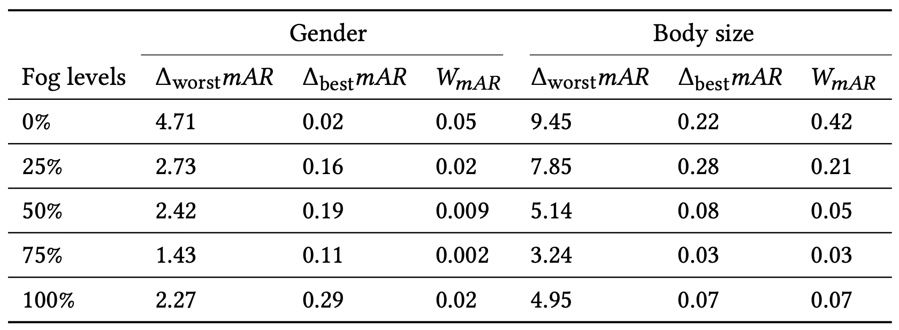
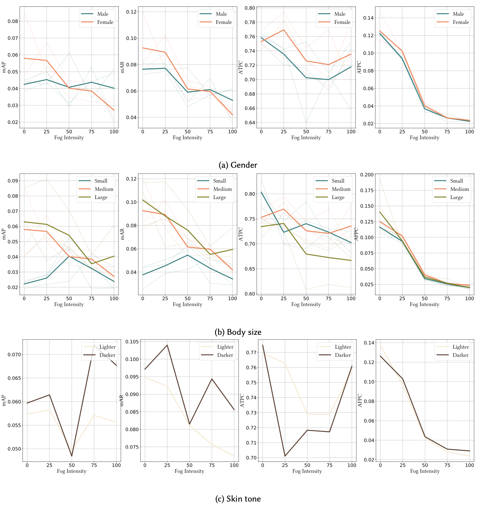

# Fairness in Autonomous Driving: Towards Understanding Confounding Factors in Object Detection in Challenging Weather (CVPR 2024 Workshop)
[Bimsara Pathiraja](https://scholar.google.es/citations?hl=en&user=7ViSGnIAAAAJ), [Caleb Liu](https://www.linkedin.com/in/calebliu0/), [Ransalu Senanayake](https://scholar.google.com.au/citations?user=mmo0bDIAAAAJ&hl=en)

[](#) 
[](https://bimsarapathiraja.github.io/fairness-in-av-project-page/) 

<!-- [](https://arxiv.org/pdf/2207.12392.pdf)  -->
<!-- [](https://drive.google.com/file/d/1MBe7aM6M9sNhbv6f94d7UkvzseJJDw2i/view?usp=share_link) 
[](https://drive.google.com/file/d/1tM8CNjyM1EorlwA-Qv8LBmWO8Adf0MiN/view?usp=share_link) -->

> **Abstract:** *The deployment of autonomous vehicles (AVs) is rapidly expanding to numerous cities. At the heart of AVs, the object detection module assumes a paramount role, directly influencing all downstream decision-making tasks by considering the presence of nearby pedestrians, vehicles, and more. Despite high accuracy of pedestrians detected on held-out datasets, the potential presence of algorithmic bias in such object detectors, particularly in challenging weather conditions, remains unclear. This study provides a comprehensive empirical analysis of fairness in detecting pedestrians in a state-of-the-art transformer-based object detector. In addition to classical metrics, we introduce novel probability-based metrics to measure various intricate properties of object detection. Leveraging the state-of-the-art FACET dataset and the Carla high-fidelity vehicle simulator, our analysis explores the effect of protected attributes such as gender, skin tone, and body size on object detection performance in varying environmental conditions such as ambient darkness and fog. Our quantitative analysis reveals how the previously overlooked yet intuitive factors, such as the distribution of demographic groups in the scene, the severity of weather, the pedestrians' proximity to the AV, among others, affect object detection performance.*

## Citation

```bibtex
Will be available soon
```

### Contents  
1) [Contributions](#contributions) 
2) [Installation](#installation)
3) [Fairness Evaluation](#fairness-evaluation)
4) [Results](#results)
5) [Visualizations](#visualizations)
6) [Contact](#contact)
7) [Acknowledgement](#acknowledgement)


### Contributions

Our key contributions are as follows:

- We propose confidence score-based metrics for fairness evaluation to bridge the gap between object detection and fairness evaluation. To our knowledge, this marks the first attempt to formulate such metrics, specifically tailored for fairness assessment in object detection.
- We demonstrate, using results from the real-world dataset, how minor data alterations could invert perceived biases. Such findings underscore the necessity of simulations to unravel the nuanced factors that affects of fairness in object detection.
- We conduct comprehensive experiments and present the trends in AV biases for protected attributes under numerous weather conditions utilizing SOTA transformer-based object detection model.


### Installation

For Carla installation and usage instructions follow guidelines [here](https://carla.readthedocs.io/en/latest/)

### Fairness Evaluation

You can reproduce the results of Carla experiments using following steps.

1. Start Carla in background

```
./CarlaUE4.sh -RenderOffScreen
```

2. Run Carla simulation and saving RGB and segmented images. You can use [Carla pedestrain catalogue](https://carla.readthedocs.io/en/latest/catalogue_pedestrians/#adult-pedestrian-1-variant-6) for finding suitable pedestrian ids.

```
python Carla-codes/main_args.py --person 0001 --weather fog --intensity 0
```

3. Generate bounding box annotations using the segmentated images

```
python Carla-codes/bbx_json.py
```

4. Generate DETR predictions for the rgb images

```
python Carla-codes/detrr-carla.py
```

5. Get metric values

```
python Carla-codes/metrics.py
```


### Results

<p align="center">
      
</p>
 Application of disparity metrics to mAR in gender and body size experiments conducted using Carla simulated environments. The skin tone evaluation is neglected due to the utilization of only a single person ID per skin tone category. The maximum observed mAR disparity, the minimum, and the Wasserstein distance between mAR distributions of each group is reported. Both worst-case disparity and Wasserstein distances show a decrease in the disparity with the fog intensity level.   

### Visualizations

<p align="center">
      
</p>

 The disparity analysis of the performance of the object detector for Carla experiments based on gender, skin tone and the body
sizes are shown. Even though gender and skin tone do not affect much, small body size (children) is detected poorly. Each category of
gender and body size plots use three types of pedestrains and the bold line represents the average line for each group. The skin tone plots
use only one pedestrian type for each category due to the limited choices in the Carla catalogue of pedestrians.

### Contact
In case of any query, create issue or contact bpathir1@asu.edu
